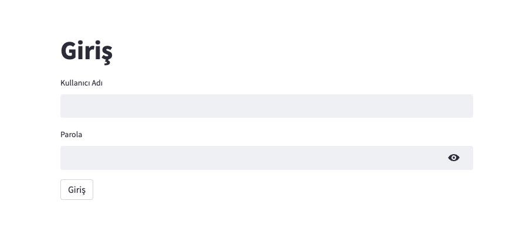
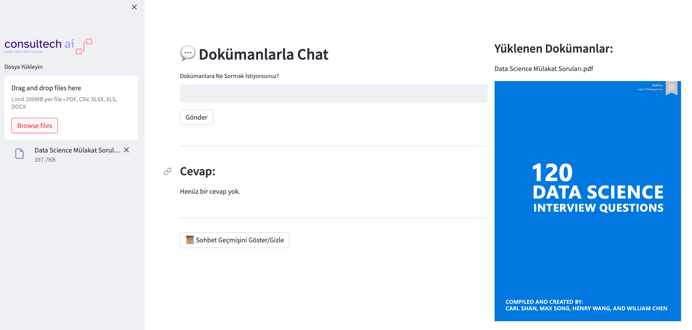

# 📚 Document Chatbot Application

## 📋 Project Overview
This project builds an interactive chatbot application using Streamlit and the LangChain library. The application allows users to upload various document types (PDF, DOCX, CSV, Excel) and interact with the documents using a chatbot. The system processes and indexes the documents, enabling users to ask questions and receive context-based answers.

## 🌟 Key Features

* Support for multiple document types: PDF, DOCX, CSV, Excel.
* Embedding and semantic search capabilities for efficient question answering.
* Chat history management, allowing users to review past interactions.
* Responsive UI built with Streamlit, including a sidebar for document upload and a main panel for interactions.

## 🛠️ Technical Requirements

* Python 3.x
* Streamlit
* pandas
* docx
* PyPDF2
* langchain
* FAISS
* dotenv

## 🧰 Application Flow

### 1. Upload Documents
   - Users upload documents in various formats through the sidebar.
   - Supported formats: PDF, DOCX, CSV, and Excel.

### 2. Extract and Index Content
   - The system extracts content and splits it into manageable chunks.
   - Embeddings are created for each chunk.
   - A semantic index is built for fast retrieval.

### 3. Ask Questions
   - Users input their questions related to the uploaded documents.
   - The system searches for relevant chunks and generates responses using an LLM.

### 4. View Responses
   - Answers are displayed on the main panel.
   - Users can toggle to view the chat history.

### Login Screen

<div align="center">
  
</div>

### Streamlit

<div align="center">
  
</div>

## 🚀 Usage

### 1. Install Dependencies
First, ensure all dependencies are installed using:
```bash
pip install -r requirements.txt
```

### 1. Run the Application
First, ensure all dependencies are installed using:
```bash
streamlit run main.py
```

## ⚠️ Known Limitations
- Limited support for non-text documents (e.g., images, multimedia).
- Requires a valid OpenAI API key for LLM functionalities.
- Performance depends on the size of the uploaded documents.

## 📖 Future Improvements
- Expand support for additional document types.
- Add support for multilingual documents.
- Optimize the embedding and search process for large-scale documents.
- Implement advanced user management and chat history export features.

## 🏗️ Contribution Guidelines
- Feel free to contribute to this project by submitting pull requests or reporting issues. Ensure that your code is well-documented and follows the PEP8 coding style.
----
This project was developed using the [LangChain](https://github.com/hwchase17/langchain) library and [Streamlit](https://streamlit.io/) for the UI.

